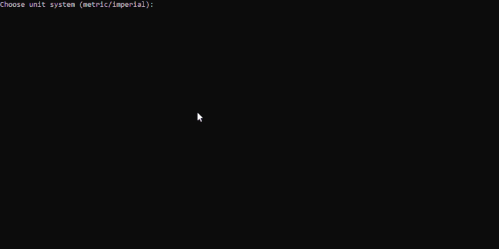
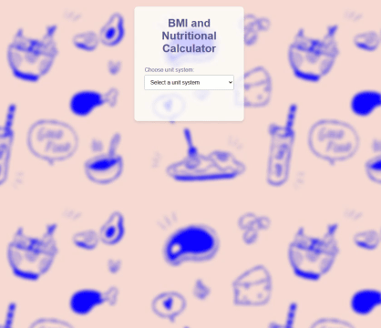

# Nutri Calc

Nutri Calc is a project that calculates Basal Metabolic Rate (BMR) and daily calorie needs based on user input. There are two implementations:

NUTRITION/
├── README.md               # Overall project description, summary, and navigation
├── calc_for_terminal/
│   ├── README.md           # Instructions, usage, and requirements for the terminal version
│   ├── nutri_calc.py       # Terminal-based version
│   └── resources/          # Assets for the terminal version's README.
│
├── calc_for_web/
│   ├── README.md           # Instructions, usage, and requirements for the web version
│   ├── index.html          # Front-end version HTML
│   ├── script.js           # Front-end JavaScript
│   ├── styles.css          # Front-end CSS
│   ├── resources/          # Assets for the README, and images for the web version.
│
└── resources/              # General resources for documentation and previews

## Repository Structure

- **calc_for_terminal/**  
  Contains the terminal-based Python version. See [calc_for_terminal/README.md](calc_for_terminal/README.md) for more details.
    
    


- **calc_for_web/**  
  Contains the web front-end version (HTML, CSS, JavaScript, and assets). See [calc_for_web/README.md](calc_for_web/README.md) for usage and installation instructions.

    
  

## Getting Started

Clone the repository and choose the version you want to run:

```sh
git clone https://github.com/cqmeronn/Nutri-Calculator.git
