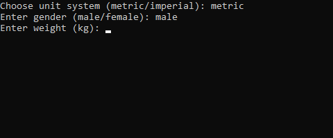
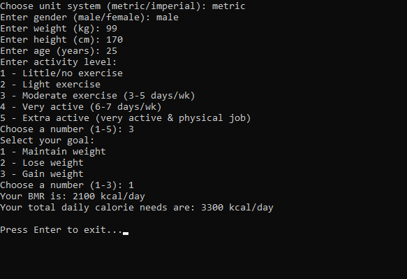

# BMR and Calorie Calculator

## Description

This Python script calculates the Basal Metabolic Rate (BMR) and estimates daily calorie needs based on user input. The script runs in interactive mode, asking for user input step by step to determine calorie needs based on activity level and goals.

## Features

- Supports both **metric** and **imperial** unit systems.
- Calculates **BMR** based on weight, height, age, and gender.
- Estimates **daily calorie needs** based on activity level.
- Provides options for **weight maintenance, loss, or gain.**
- Validates all inputs and prompts again if invalid values are entered.

## Requirements

- Python 3.7 or higher

## Installation

No external dependencies are required. Simply clone the repository or download `nutri_calc.py` and run it with Python.

```sh
python nutri_calc.py
```

## Usage

### Interactive Mode

Run the script without arguments to enter values manually:

```sh
python nutri_calc.py
```

The script will ask for:

1. **Unit system** (metric/imperial)
2. **Gender** (male/female)
3. **Weight**
4. **Height**
5. **Age**
6. **Activity level**
7. **Goal** (maintain, lose, gain weight)
8. **Weight change goal** (for weight loss/gain)

### Handling Invalid Inputs

If an invalid value is entered, the script will notify the user and ask for the input again.



## Example Output


