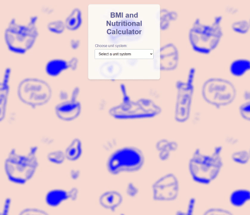
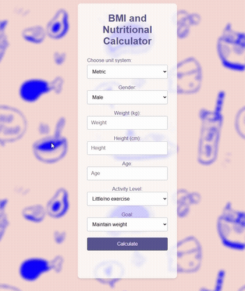
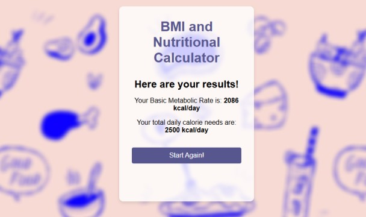

# BMI and Nutritional Calculator

This is a simple web-based **BMI and Nutritional Calculator** that helps users determine their **Body Mass Index (BMI)** and **daily calorie needs** based on their weight, height, age, gender, activity level, and fitness goals.

## 🖥️ Demo

## 🚀 Features

- Choose between **Metric** and **Imperial** unit systems.
- Calculates **BMI** based on user input.
- Estimates **daily calorie needs** based on activity level.
- Allows users to select **weight maintenance, weight loss, or weight gain** goals.
- Provides recommendations for **daily caloric intake**.
- Smooth UI/UX with interactive animations.

## 📸 Screenshots

### Main Interface

### Calculation Results

## 🛠️ Technologies Used

- **HTML5** – Structure of the application
- **CSS3** – Styling and animations
- **JavaScript (Vanilla)** – Logic and calculations

## 📄 How to Use

1. Open `index.html` in a web browser.
2. Select your **unit system** (Metric or Imperial).
3. Fill in your **weight, height, age, gender, and activity level**.
4. Choose your **fitness goal** (Maintain weight, Lose weight, Gain weight).
5. Click the **"Calculate"** button to get your BMI and daily calorie requirements.
6. Review the displayed results.
7. Click **"Start Again!"** to reset the form.
